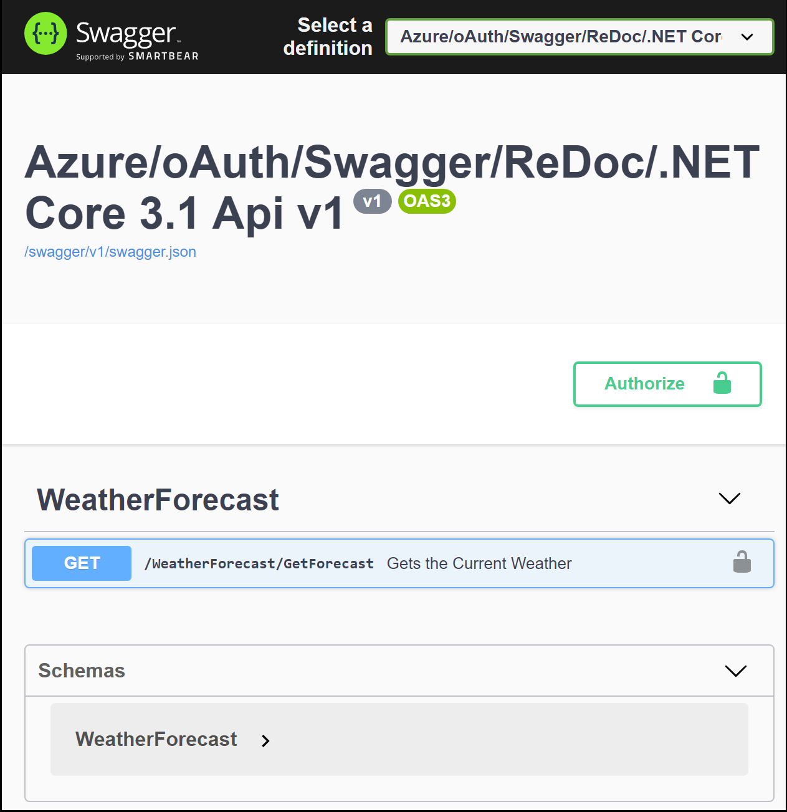
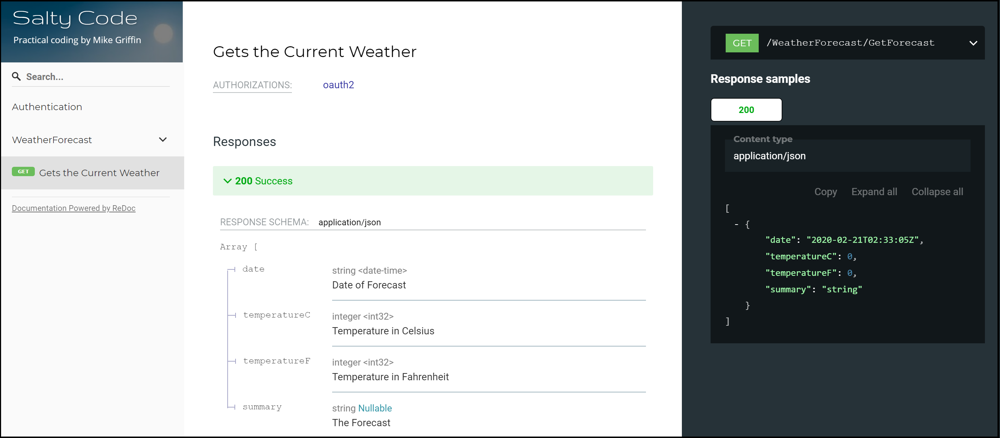

# 'AzureOAuthSwaggerReDoc' 
This repo is expained in Mike's blog @ [SaltyCode](https://saltycode.blogspot.com/2020/02/net-core-31-azure-oauth-swagger-and.html)

This example is a pure .NET Web API REST solution (**NOT** an ASP.NET Web Solution) that provides a simple boilerplate example for getting your REST API up-to-snuff. This is probably about the most simple version you'll find with all of these technologies working together. 

* .NET Core 3.1
* Basic Controller Endpoint
* oAuth Authentication Against an Azure Tenant
* Swagger Implementation (with oAuth support)
* Ability to Serve up Static HTML Files
* ReDoc Implementation with Custon Logo
* XML Documentation to Enhance Swagger and ReDoc
* Works on localhost, IIS Express, IIS, and Azure

Swagger => https://localhost:44326/swagger/index.html <br/>
ReDoc   => https://localhost:44326/documentation/

## Swagger Screen Shot


## Redoc Screen Shot


## NuGet Packages Used

```xml
<PackageReference Include="Microsoft.AspNetCore.Authentication" Version="2.2.0" />
<PackageReference Include="Microsoft.AspNetCore.Authentication.JwtBearer" Version="3.1.2" />
<PackageReference Include="Microsoft.Extensions.ApiDescription.Server" Version="3.1.2">
<PackageReference Include="Swashbuckle.AspNetCore.Annotations" Version="5.0.0-rc5" />
<PackageReference Include="Swashbuckle.AspNetCore.Swagger" Version="5.0.0-rc5" />
<PackageReference Include="Swashbuckle.AspNetCore.SwaggerGen" Version="5.0.0-rc5" />
<PackageReference Include="Swashbuckle.AspNetCore.SwaggerUI" Version="5.0.0-rc5" />
  ```
